Sure, here's the updated README for your Travel App:

# YourTravelApp


Explore the holiday deals through YourTravelApp, your ultimate travel companion.

Visit the live site: [YourTravelApp.com](https://travelapp.com/)

Embark on a virtual journey, discover new destinations, and plan your next adventure!

## Contents

- [User Experience](#user-experience-ux)
  - [User Stories](#user-stories)
- [Design](#design)
  - [Colour Scheme](#colour-scheme)
  - [Typography](#typography)
  - [Imagery](#imagery)
  - [Wireframes](#wireframes)
  - [Features](#features)
    - [Destination Discovery](#destination-discovery)
    - [Travel Guides](#travel-guides)
    - [User Profiles](#user-profiles)
    - [Interactive Maps](#interactive-maps)
    - [Future Enhancements](#future-enhancements)
  - [Accessibility](#accessibility)
- [Technologies Used](#technologies-used)
  - [Languages Used](#languages-used)
  - [Frameworks, Libraries &amp; Programs Used](#frameworks-libraries--programs-used)
- [Deployment &amp; Local Development](#deployment--local-development)
  - [Deployment](#deployment)
  - [Local Development](#local-development)
    - [How to Fork](#how-to-fork)
    - [How to Clone](#how-to-clone)
- [Testing](#testing)
  - [Automated Testing](#automated-testing)
    - [W3C Validator](#w3c-validator)
    - [JavaScript Validator](#javascript-validator)
    - [Lighthouse](#lighthouse)
  - [Manual Testing](#manual-testing)
    - [Testing User Stories](#testing-user-stories)
    - [Full Testing](#full-testing)
- [Credits](#credits)
  - [Code Used](#code-used)
  - [Content](#content)
  - [Media](#media)
  - [Acknowledgments](#acknowledgments)

---


## User Experience (UX)

### User Stories

#### First Time Visitor Goals

- I want to explore new travel destinations and get inspired for my next trip.
- I want a user-friendly interface that allows me to navigate through the site effortlessly.
- I want to find comprehensive travel guides and information about different holiday packages.

#### Returning Visitor Goals

- I want to interact with an interactive map to plan my itinerary effectively.

#### Frequent Visitor Goals

- I want to contribute by sharing my travel experience and tips.
- I want to connect with other travel enthusiasts .

---

## Design

### Colour Scheme

"The color scheme is thoughtfully curated to capture the essence of adventure and wanderlust. While predominantly earthy tones are employed to evoke a sense of groundedness and connection to nature, the design also incorporates elements of glassmorphism. Background images are strategically utilized to infuse depth and dimension, creating a visually immersive experience that echoes the beauty of the natural world."

- Primary Color: `#643279` (Purple)
- Secondary Colour: `#ffffff` (Shiny White)
- Accent Colour: `#c06c84` (Dusty Rose)
- Background: `#f8b400` (Bright Yellow)

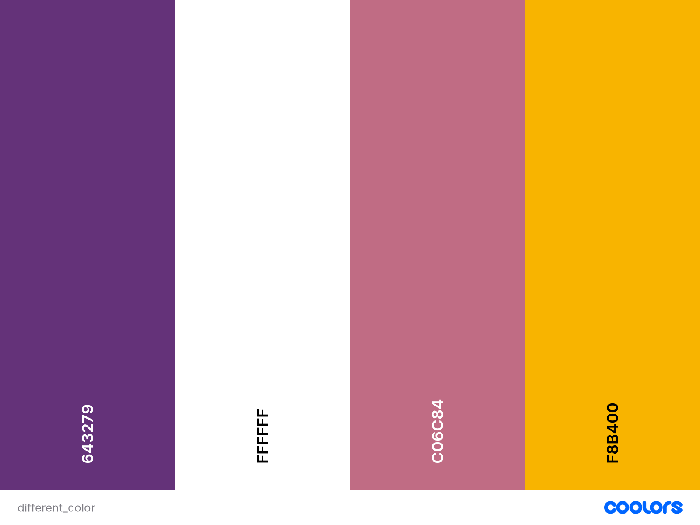

### Typography

The chosen fonts are both modern and easy to read, enhancing the overall user experience.by help from this [Fontpair](https://www.fontpair.co/) website guide.

- Page Title: [Roboto Slab ](https://fonts.google.com/specimen/Roboto?query=roboto)
- Body Text title: [amulya](https://www.fontshare.com/fonts/amulya)
- Body text : [Roboto](https://fonts.google.com/specimen/Roboto?query=roboto)
- Body text : [amulya](https://www.fontshare.com/fonts/amulya)
  

### Imagery

Stunning images of landscapes and iconic landmarks are incorporated to transport users to different corners of the world. Each page features visually appealing photos to enhance the travel experience.

### Wireframes

Wireframes for mobile, desktop were created using microsoft paint.

--Hompage -- hompage desktop and mobile

- 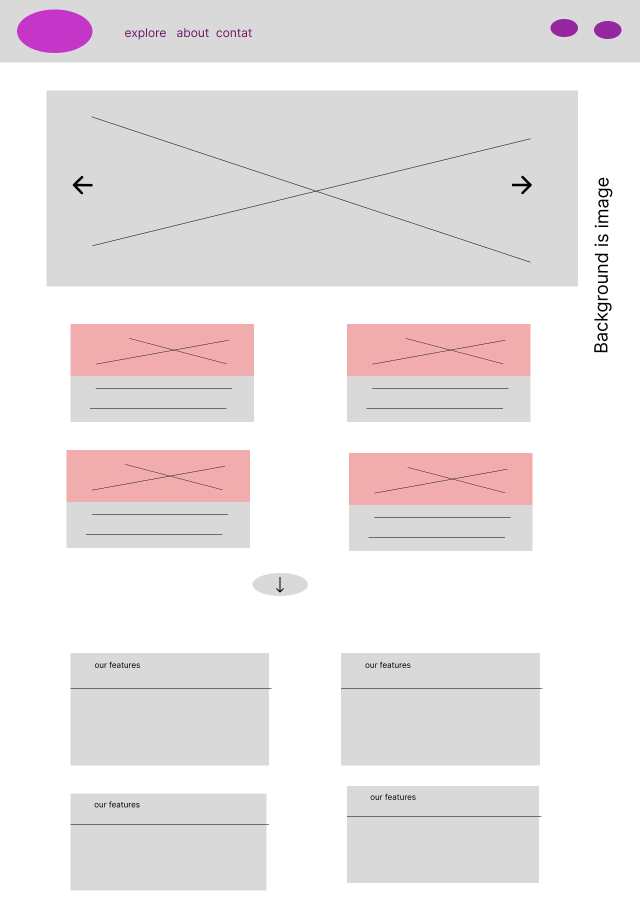- 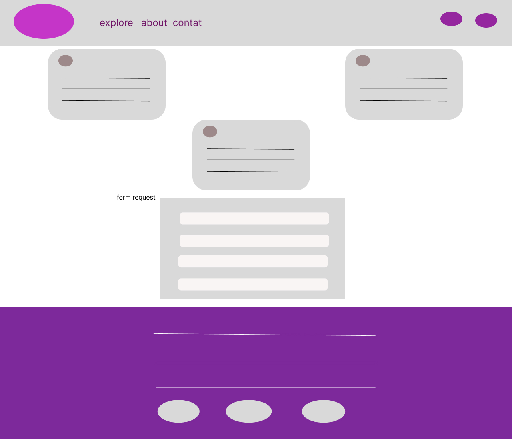-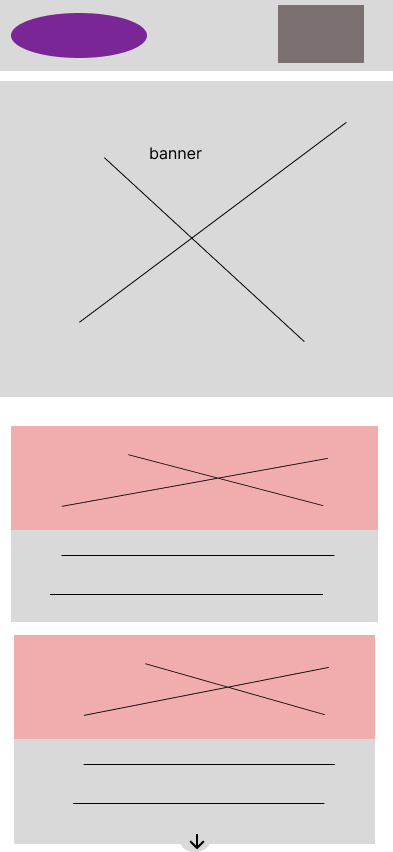-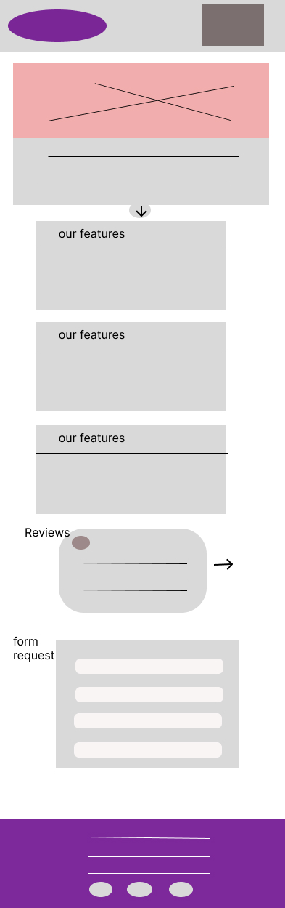

--Explored page  -- about share info of their holiday

- 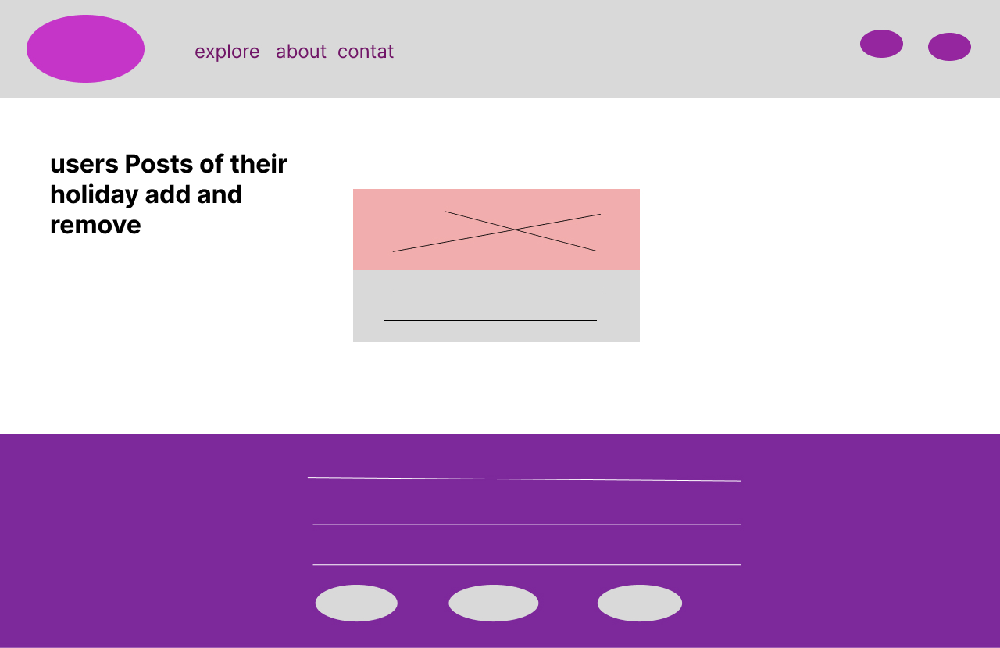
- 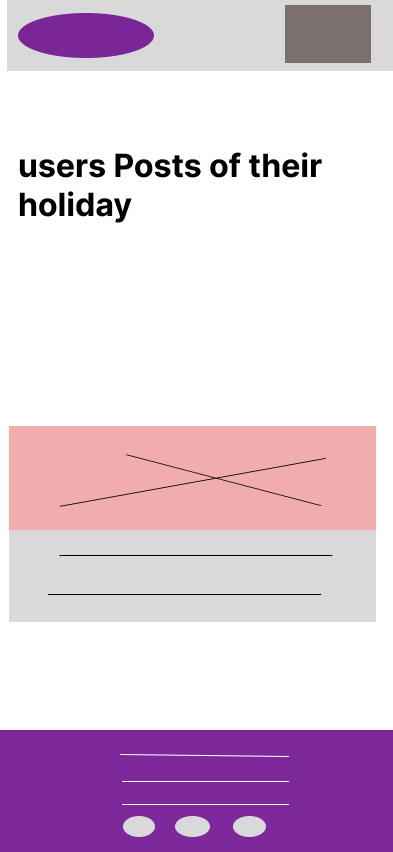

--About page  -- about compony view

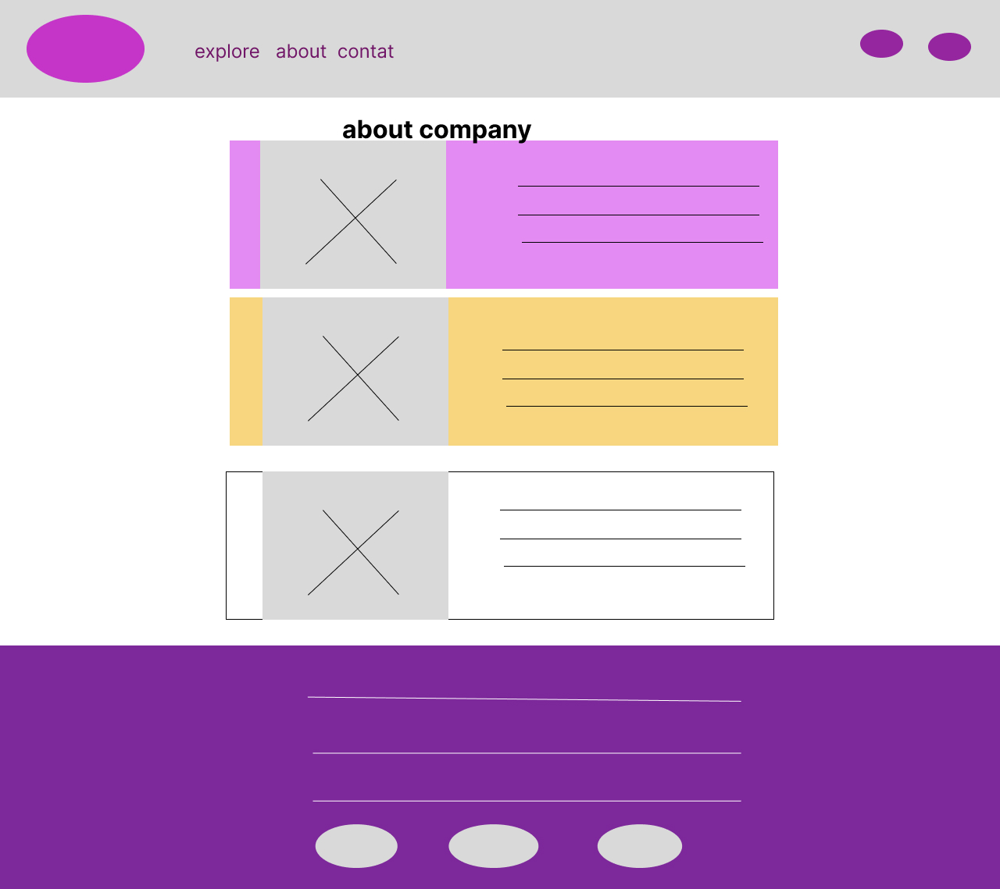
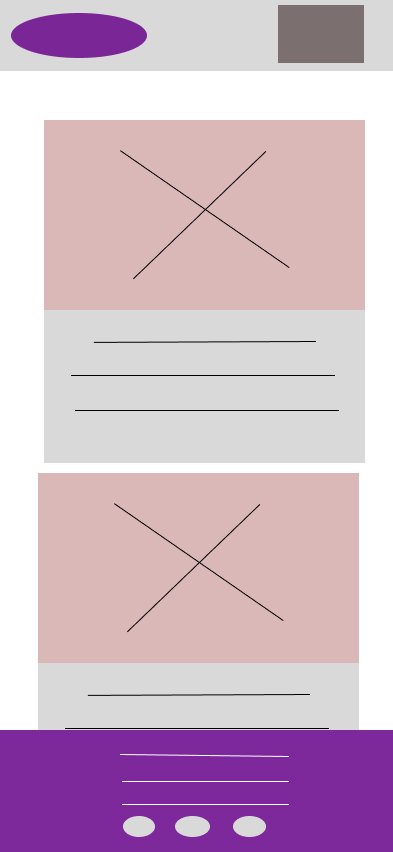

-- Account page -- user own info page

- 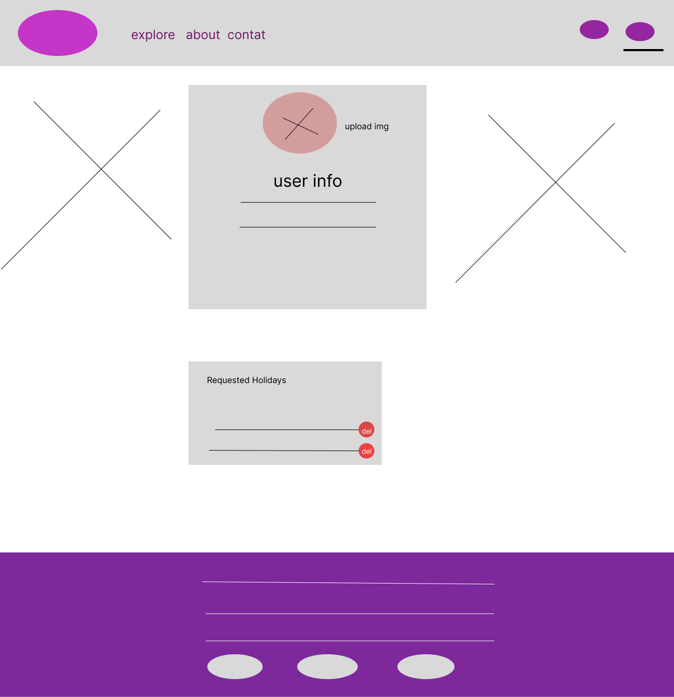 - 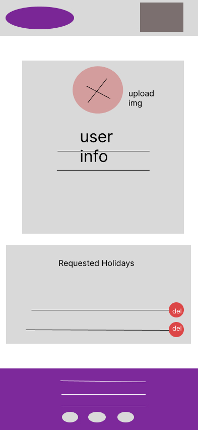

-- contact  page -- company contact information

-  - 

--Login page  -- user login page

- 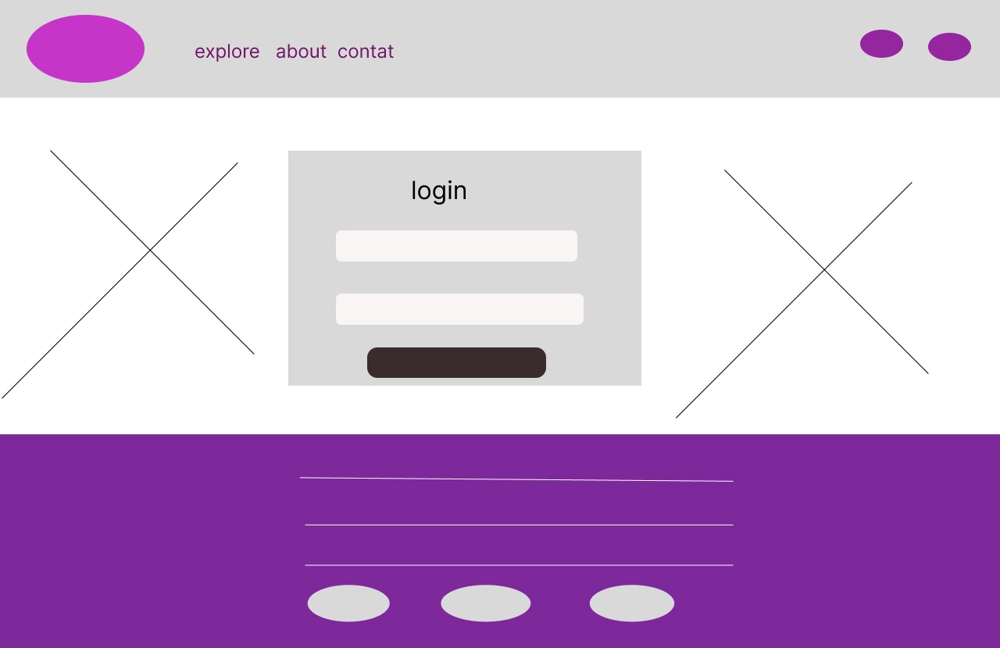 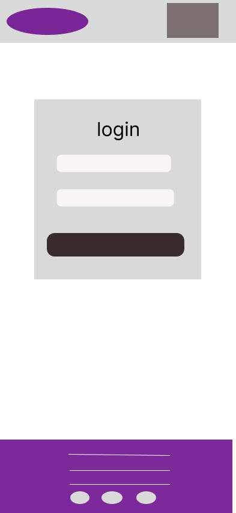

--Signup page  -- user sign up page

- 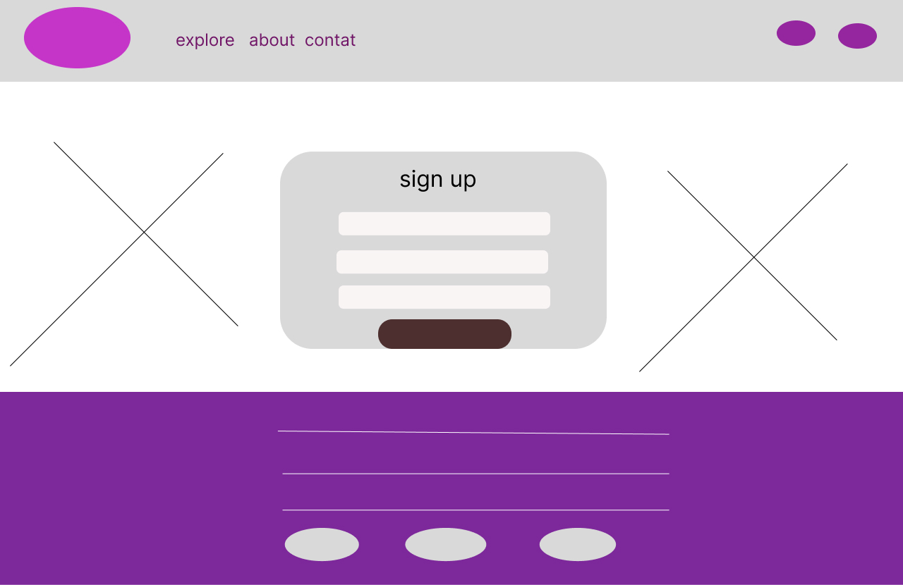 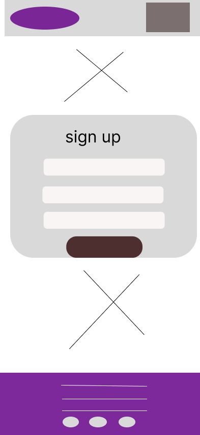

### Features

Explore the rich features of YourTravelApp, meticulously crafted to offer users an immersive and dynamic journey. Leveraging the power of Flask and a robust database system, every corner of the application pulsates with interactivity, ensuring seamless navigation and personalized experiences tailored to each user's preferences.

1. **Responsive Design:**

   - All pages are seamlessly responsive, ensuring a consistent and

 optimal viewing experience across all devices.

2. **Destination Discovery:**

   - Discover new travel destinations through curated cads and showing data in modal with interactive map .
3. **Travel Guides:**

   - Access comprehensive travel guides with useful tips, recommendations, and insights for various populare cities.
4. **User Profiles:**

   - Create a personalized user profile to share travel experiences, connect with other users, in explored page
5. **Interactive Maps:**

   - Plan your itinerary effectively with interactive maps showcasing points of interest, hotels, and attractions.

#### Future Enhancements

- Integration with booking platforms to facilitate hotel and tour reservations.
- User-generated content, including reviews, photos, and travel stories.
- Advanced search filters for tailored destination recommendations.
- Social media integration for seamless sharing and community engagement.

### Accessibility

YourTravelApp is committed to accessibility and strives to provide an inclusive experience for all users. The site is designed with accessibility features such as:

- Semantic HTML for screen readers and assistive technologies.
- High contrast color schemes for improved readability.
- Keyboard navigation support for users with mobility impairments.
- Alt text for images to ensure content comprehension for visually impaired users.

---

-- Deployed pages


### **All pages header and footer was at base html file and specific route generate that page specific route place here for that page .**

---


### **Home page** (route and page images)


### Route Explanation

- **Page**: Home Page
- **Method**: POST, GET
- **Purpose**: Renders the home page and handles the submission of wished holidays.
- **Tech Used**: Flask, Flask SQLAlchemy, Flask-WTF, Bootstrap (for flash messages)
- **Functionality**:
  - Queries all travel packages from the database.
  - Initializes a form for submitting wished holidays (`WishedHolidayForm`).
  - If the form is submitted (`POST` request) and passes validation:
    - Creates a new `WishedHoliday` object with the submitted data.
    - Adds the new `WishedHoliday` object to the database session.
    - Commits the changes to the database.
    - Flashes a success message to the user.
    - Redirects the user to the wished holiday page (`wished_holiday` route).
  - If an exception occurs during database operations:
    - Logs the error message.
    - Flashes an error message to the user.
    - Renders the home page again with the form to handle the exception.
- **Template**: Renders the `home.html` template, passing the following data:
  - `travel_packages`: List of all travel packages queried from the database.
  - `form`: Instance of the `WishedHolidayForm` for submitting wished holidays.


- 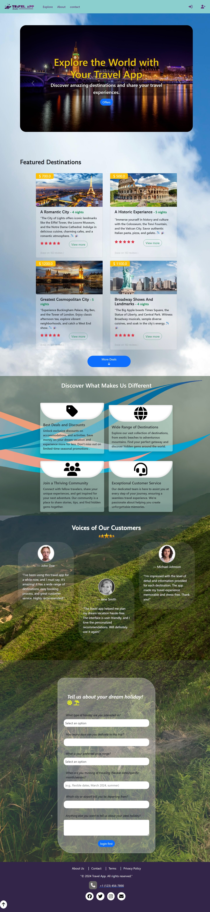- 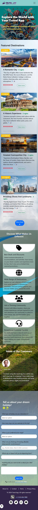


#### Home Page web

The homepage of Travelapp offers a captivating introduction to the travel experience, blending aesthetics and functionality seamlessly.

- **Site Name and Logo:**

  - The site name and logo take center stage, creating a distinctive visual identity for TravelWander.com.
- **Navbar:**

  - An intuitive navigation bar ensures easy exploration, allowing users to effortlessly access different sections of the website.
- **Social Icons:**

  - Social icons are strategically placed, providing quick links to connect with TravelWander.com on various social media platforms.
- **Welcome Text:**

  - A warm welcome text invites users to embark on a virtual journey, setting the tone for an immersive travel experience.
- **Continents Slides:**

  - Three slides showcasing breathtaking images of different continents create a visually stunning backdrop, offering a glimpse into the diverse destinations awaiting exploration.
- **Company Information:**

  - Information about the company is elegantly presented, providing insights into TravelWander's mission and offerings.
- **Customer Reviews:**

  - Customer reviews add a personal touch, offering authentic perspectives and enhancing the credibility of the travel services.
- **Background :**

  - A dynamic background  runs throughout the homepage, adding a touch of dynamism and reinforcing the travel theme.
- **Modal for Deals:**

### Homepage Travel Deals Modal

The homepage of travelapp introduces users to enticing travel deals displayed as interactive cards. Upon clicking on a travel deal card, users can access a detailed modal window that provides comprehensive information about the selected deal. This modal enhances the user experience by offering a convenient way to explore key details and make informed decisions regarding their travel plans.

- 
- **Modal Content:**

  - The modal window presents essential details such as the price of the travel package, destination, duration of the holiday, and any special offers or discounts available. By displaying this information prominently, users can quickly assess the value and suitability of the travel deal, facilitating efficient decision-making.
- **Interactive Map:**

  - In addition to textual information, the modal incorporates an interactive map feature that visualizes the destination of the travel package. By leveraging mapping technologies, users can gain insights into the geographical location, nearby attractions, and points of interest associated with the holiday destination, enhancing their understanding and appreciation of the travel offer.
- **Contact Information:**

  - To further assist users and address any inquiries or concerns, the modal includes contact details such as telephone numbers or email addresses for reaching out to travelapp's customer support team. This direct communication channel enables users to seek personalized assistance, receive expert guidance, and make informed decisions regarding their travel arrangements.

By integrating a feature-rich modal window into the homepage's travel deal cards, travelapp enhances user engagement and satisfaction, providing a seamless browsing experience that empowers users to explore, evaluate, and book their dream holidays with confidence and ease.

---


### Explore Route Explanation

* **Page** : Explore Page
* **Method** : POST, GET
* **Purpose** : Renders the explore page and handles the addition of new destinations.
* **Tech Used** : Flask, Flask SQLAlchemy, Flask-WTF, Bootstrap (for flash messages)
* **Functionality** :
* Initializes a form for adding destinations (`AddDestinationForm`).
* Checks if the user is authenticated:
  * If authenticated:
    * Handles form submission:
      * Saves the uploaded image and retrieves the file path.
      * Creates a new `Destination` object with the submitted data.
      * Adds the new `Destination` object to the database session.
      * Commits the changes to the database.
      * Flashes a success message to the user.
      * Redirects the user back to the explore page.
    * Retrieves all destinations ordered by name from the database.
  * If not authenticated:
    * Retrieves all destinations from the database.
* Renders the `explore.html` template, passing the following data:
  * `form`: Instance of the `AddDestinationForm` for adding destinations.
  * `all_destinations`: List of all destinations queried from the database.

This route handles the rendering of the explore page and allows authenticated users to add new destinations. It utilizes forms for data submission and interacts with the database to store and retrieve destination information.

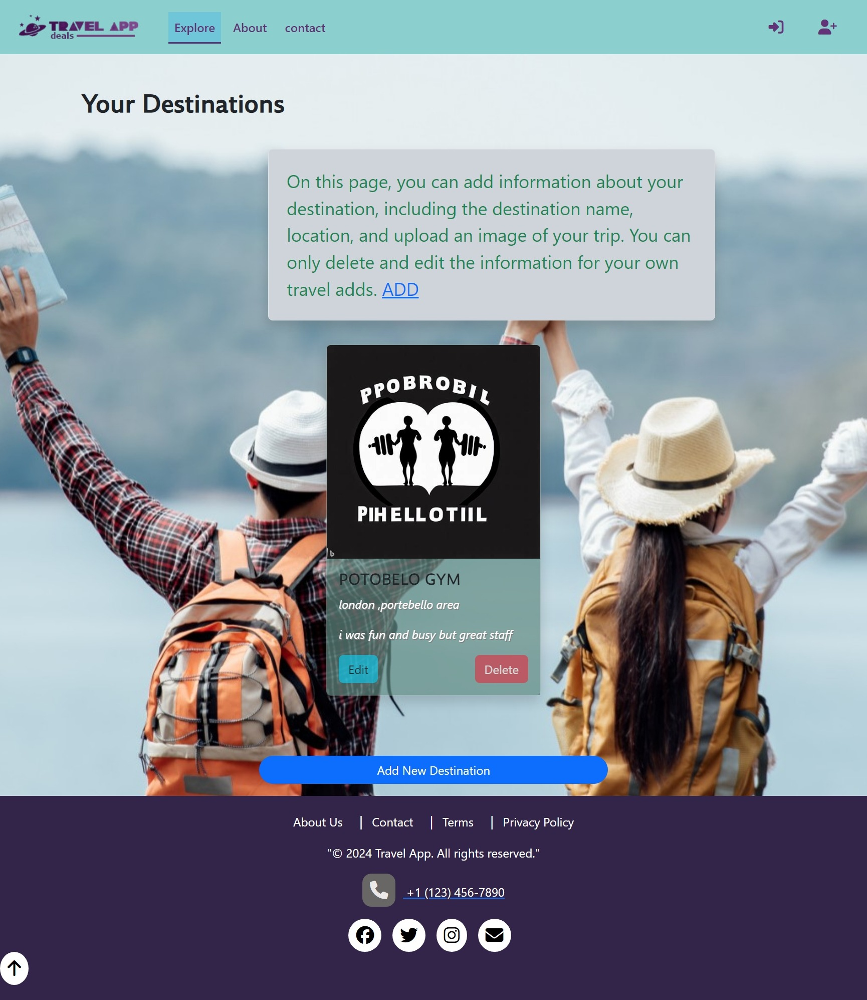- 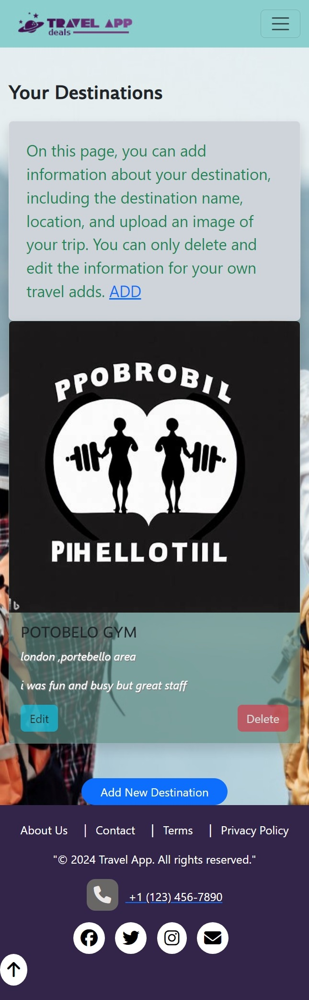

## Explore Page web

The "Explore" page of travelapp serves as a dynamic platform for users to share their latest holiday experiences, complete with captivating images and personal anecdotes. Utilizing Bootstrap's card feature, each submission is elegantly presented in a visually appealing format, enhancing readability and engagement.

- **User Submissions:**

  - Users can effortlessly post their recent holiday details, including destination highlights, activities, and memorable moments. Accompanied by stunning images, each submission offers a unique glimpse into diverse travel experiences, inspiring others to embark on their adventures.
- **Interactive Cards:**

  - Bootstrap cards facilitate seamless navigation and interaction, allowing users to explore submissions with ease. The inclusion of edit and delete buttons empowers users to modify their content, ensuring flexibility and control over their posted experiences.
- **Database Interaction:**

  - Behind the scenes, travelapp seamlessly interacts with the database to retrieve, display, and manage user submissions. Leveraging the power of Flask and SQLAlchemy, the platform delivers a seamless user experience, enabling smooth data handling and efficient content management.

Through a combination of intuitive design, interactive features, and robust database functionality, the "Explore" page invites users to share their travel tales, connect with fellow adventurers, and discover new destinations in an immersive and engaging manner.

---


### about Route Explanation

- **Page**: About Us Page
- **Method**: POST, GET
- **Purpose**: Renders the about us page.
- **Tech Used**: Flask, Flask SQLAlchemy, Jinja (for templating)
- **Functionality**:
  - Renders the `about_us.html` template, which displays information about the website or organization.
- **Template**: Renders the `about_us.html` template, which typically includes information such as the purpose of the website, team members, mission statement, and contact information.

This route simply renders the about us page without any additional functionality. It serves as a static page to provide information about the website or organization to the users.

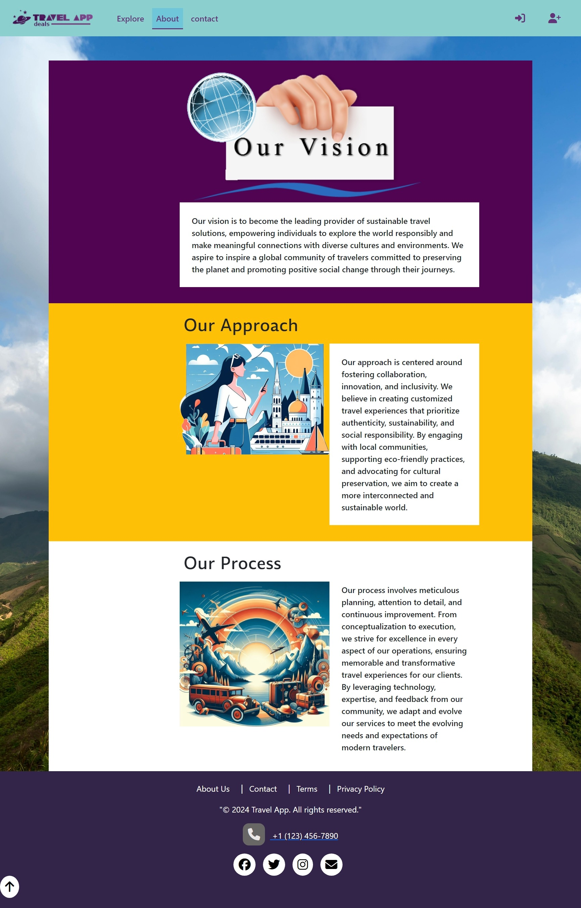- 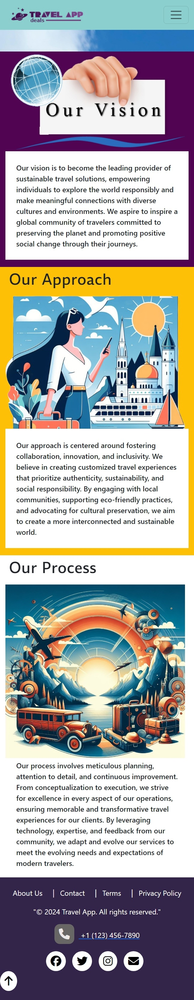

#### About Page

The "About" page of travelapp offers a glimpse into our vision, approach, and the process behind our platform's creation. Designed to be both informative and engaging, this page provides insights into what drives us and how we strive to deliver exceptional travel experiences.

- **Our Vision:**

A compelling image accompanies our vision statement, symbolizing our commitment to revolutionizing the way people explore the world. Through innovative technology and unparalleled service, we aspire to inspire wanderlust and facilitate memorable journeys for every traveler.

- **Our Approach:**

An illustrative image complements our approach, highlighting our dedication to personalization, convenience, and sustainability. We believe in tailoring travel experiences to individual preferences, simplifying the booking process, and promoting eco-conscious practices to protect our planet for future generations.

- **Our Process:**

Step-by-step visuals outline our process, from conceptualization to implementation, showcasing our meticulous attention to detail and user-centric design philosophy. By prioritizing user feedback, continuous improvement, and seamless integration of cutting-edge technologies, we ensure that every aspect of travelapp reflects our commitment to excellence.

---


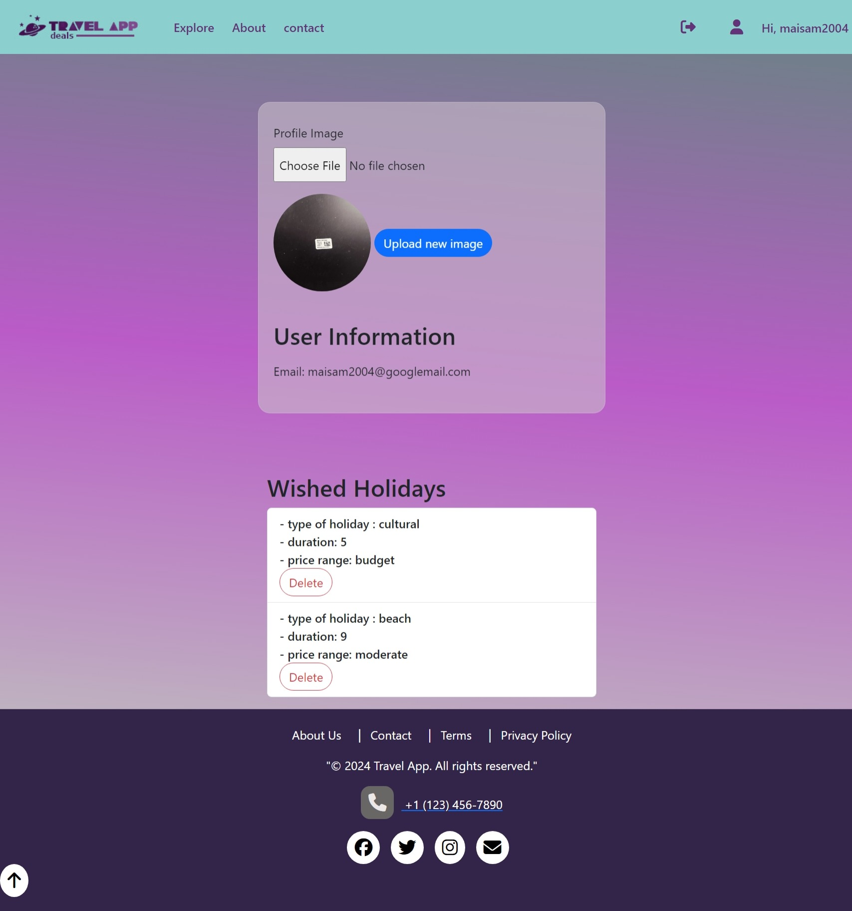- 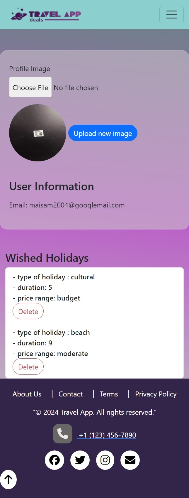

## Account Page

The "Account" page of travelapp offers users a personalized space to view and manage their profile information, including uploaded images and details of their last wished holiday. With a focus on user-centric design and functionality, this page provides a seamless experience for users to interact with their account settings and preferences.

- **Profile Information:**

  - Users can access and update their profile information, including username, email, and any additional details provided during registration. The user-friendly interface ensures easy navigation and efficient management of account details.
- **Upload Personal Image:**

  - A dedicated feature enables users to upload a personalized profile image, enhancing their presence and adding a touch of personalization to their account. Utilizing Flask's file upload functionality, users can effortlessly select and upload images directly from their device.
- **Last Wished Holiday:**

  - As part of the user experience enhancement, travelapp displays details of the user's last wished holiday on the "Account" page. Leveraging data stored in the WishedHoliday table, users can conveniently reference their desired holiday preferences, facilitating future travel planning and exploration.
- **Database Integration:**

  - Behind the scenes, travelapp seamlessly integrates with a database system to retrieve and display user information, uploaded images, and wished holiday details. Leveraging Flask-SQLAlchemy, the platform ensures secure data storage and efficient data retrieval, enhancing the overall user experience.

Through a combination of intuitive design, personalized features, and robust database functionality, the "Account" page empowers users to manage their profile, upload personalized content, and access essential information, fostering a seamless and engaging user experience.
---------------------------------------------------------------------------------------------------------------------------------------------------------------------------------------------------------------------------------------------------------------------------------

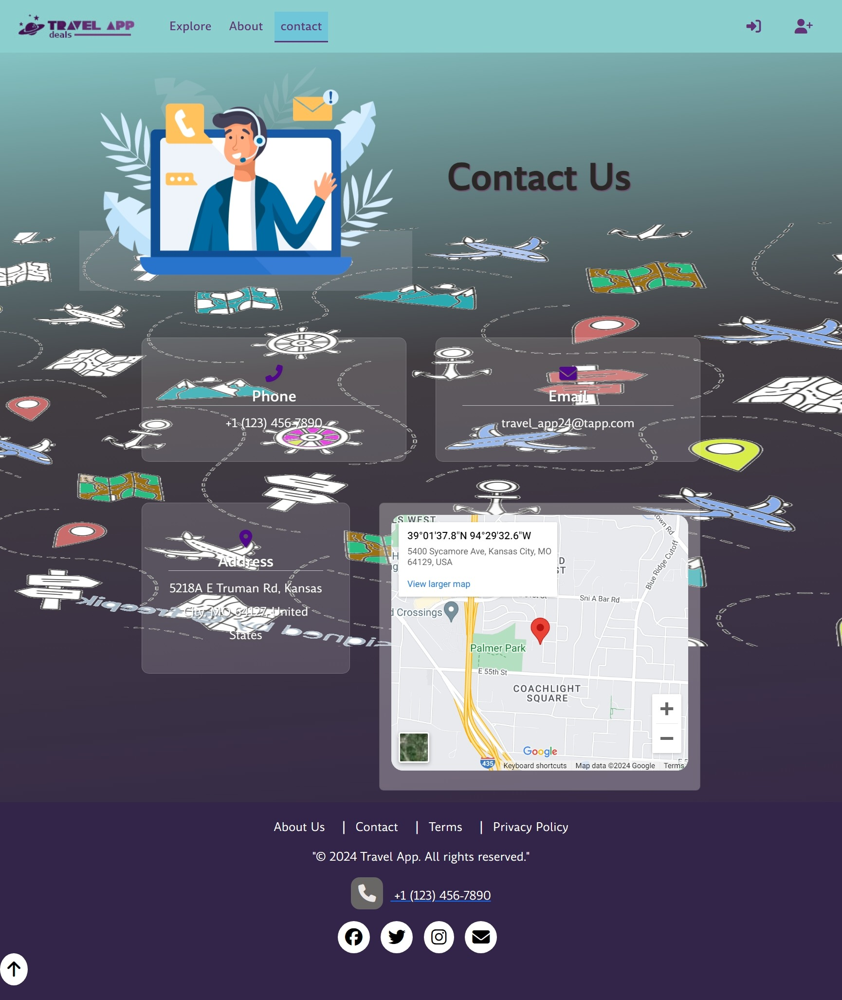- 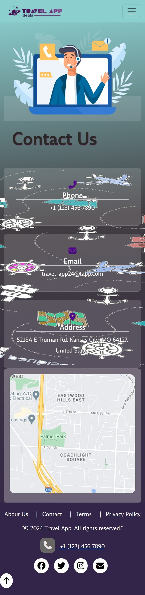

## Contact Page

The "Contact" page of travelapp serves as a centralized hub for users to access essential contact information and connect with the platform's administrators. With a focus on accessibility and user engagement, this page provides convenient access to support channels and location details.

- **Contact Information:**

  - Users can easily locate contact details, including email addresses and phone numbers, enabling seamless communication with travelapp's support team. The intuitive layout ensures quick access to essential information, facilitating efficient resolution of inquiries and support requests.
- **Interactive Map:**

  - An interactive map feature enhances the user experience by visually representing the geographical location of travelapp's headquarters or primary operating regions. Leveraging mapping APIs, users can explore the platform's physical presence and gain insights into its global reach and coverage.
- **Email Integration:**

  - To streamline communication and facilitate direct inquiries, travelapp offers users the option to send emails directly from the "Contact" page. By integrating email functionality, users can compose messages within the platform, minimizing friction and enhancing convenience.
- **User-friendly Interface:**

  - The "Contact" page features a user-friendly interface designed to promote ease of use and accessibility. Clear navigation elements and prominently displayed contact information ensure that users can quickly locate and utilize the available communication channels without any hassle.

Through its comprehensive approach to user support and engagement, the "Contact" page reinforces travelapp's commitment to customer satisfaction and service excellence. By providing users with accessible contact information, interactive map functionality, and seamless email integration, the platform empowers users to connect with ease and confidence, fostering a positive and enriching user experience.

---

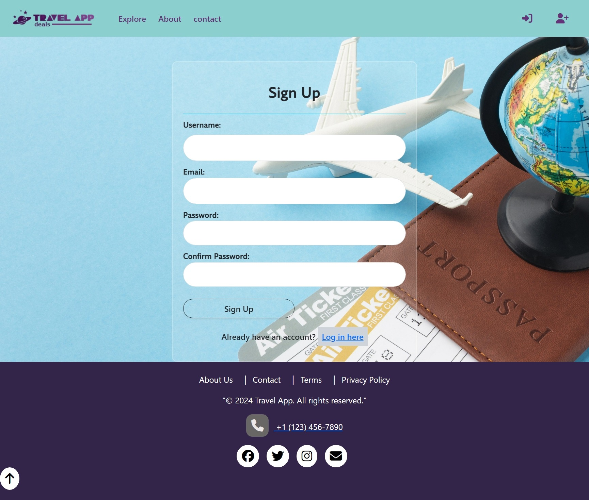- 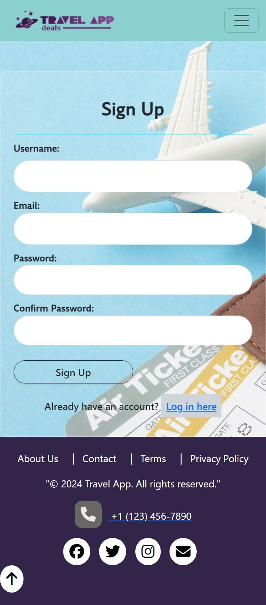

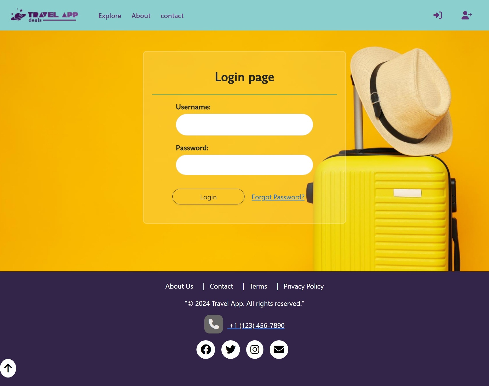- 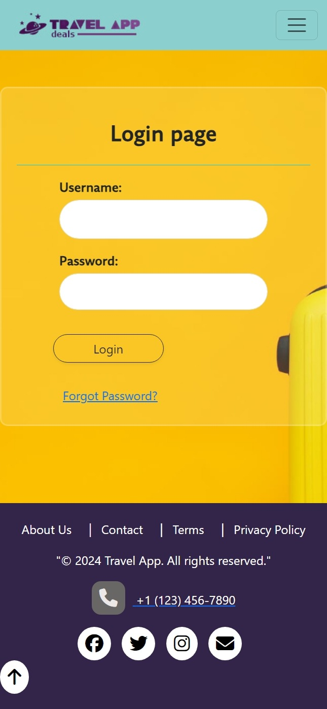

## Signup and Login Pages

The "Signup" and "Login" pages of travelapp serve as key entry points for users to access and interact with the platform's features securely. Designed with a focus on user authentication and account management, these pages provide a seamless and intuitive experience for new users registering for membership and existing members logging into their accounts.

- **Signup Page:**

  - The "Signup" page enables new users to create an account and become members of the travelapp community. With a user-friendly registration form, users can provide essential information, such as username, email address, and password, to establish their accounts securely. Stringent validation checks ensure data accuracy and integrity, enhancing the overall signup process and mitigating potential errors or discrepancies.
- **Login Page:**

  - The "Login" page offers registered users convenient access to their accounts, facilitating secure authentication and personalized interactions with travelapp's features. Utilizing industry-standard encryption protocols, such as HTTPS and secure password hashing, the login process ensures robust protection of user credentials and sensitive information. Through a streamlined login interface, users can enter their credentials confidently, knowing that their privacy and security are prioritized.
- **Database Integration:**

  - Both the "Signup" and "Login" pages seamlessly interact with travelapp's secure database infrastructure, storing and retrieving user account data in a protected environment. By leveraging database technologies and secure authentication mechanisms, the platform maintains data integrity and confidentiality, safeguarding user information against unauthorized access or manipulation.
- **Responsive Design:**

  - The "Signup" and "Login" pages feature responsive design elements, ensuring optimal display and functionality across various devices and screen sizes. Whether accessing the platform from a desktop computer, tablet, or smartphone, users can enjoy a consistent and accessible signup and login experience, enhancing usability and convenience.

Through its commitment to user privacy, security, and usability, travelapp's "Signup" and "Login" pages establish a strong foundation for user engagement and satisfaction. By prioritizing data protection, seamless integration, and responsive design, the platform empowers users to register, login, and access its features with confidence and ease.

## Technologies Used

### Languages Used

- HTML5
- CSS3
- PYTHON
- FLASK
- JavaScript

### Frameworks, Libraries & Programs Used

- [Python Flask](https://flask.palletsprojects.com/): Micro web framework for building web applications in Python.
- [PostgreSQL](https://www.postgresql.org/): Open-source relational database management system for storing application data.
- [Bootstrap](https://getbootstrap.com/): Front-end framework for responsive design.
- [jQuery](https://jquery.com/): JavaScript library for DOM manipulation and event handling.
- [Font Awesome](https://fontawesome.com/): Icon library for scalable vector icons.
- [Google Fonts](https://fonts.google.com/): Source of custom fonts for enhanced typography.
- [Adobe XD](https://www.adobe.com/products/xd.html): Design tool for wireframing and prototyping.
- [GitHub](https://github.com/): Version control and collaboration platform.
- [Git](https://git-scm.com/): Distributed version control system.
- [Visual Studio Code](https://code.visualstudio.com/): Code editor for writing and editing code.

---

## Deployment & Local Development

### Deployment

YourTravelApp is deployed using GitHub Pages. To deploy the site:

1. Navigate to the repository settings on GitHub.
2. Scroll down to the GitHub Pages section.
3. Select the main branch as the source.
4. The site will be automatically deployed, and the link will be provided.

### Local Development

To run YourTravelApp locally, follow these steps:

#### How to Fork

1. Log in to GitHub and locate the repository: [YourTravelApp](https://github.com/yourusername/yourtravelapp).
2. At the top right of the page, click the Fork button.
3. After forking, you'll have a copy of the repository in your GitHub account.

#### How to Clone

1. Clone the repository to your local machine using the following command:

   ```
   git clone https://github.com/yourusername/yourtravelapp.git
   ```
2. Navigate to the project directory:

   ```
   cd yourtravelapp
   ```
3. Open the index.html file in your browser to view the site locally.

---

## Testing

### Automated Testing

Automated testing was conducted using various tools to ensure the quality and performance of YourTravelApp.

#### W3C Validator

All HTML files were tested using the W3C Markup Validation Service to identify any syntax errors or warnings.

#### JavaScript Validator

JavaScript code was validated using JSHint to detect any potential errors or issues.

#### Lighthouse

Lighthouse audits were performed to assess the site's performance, accessibility, best practices, and SEO.

### Manual Testing

Manual testing was conducted to validate user stories and ensure the functionality of all features.

#### Testing User Stories

- **First Time Visitor Goals:**

  - Navigated through the site to explore different destinations.
  - Found the interface intuitive and easy to use.
  - Accessed travel guides and information about holiday packages.
- **Returning Visitor Goals:**

  - Interacted with the interactive map to plan an itinerary.
- **Frequent Visitor Goals:**

  - Created a user profile and shared travel experiences.
  - Connected with other users through the community forum.

#### Full Testing

Comprehensive testing was performed on all pages, forms, buttons, and interactive elements to ensure proper functionality and responsiveness across devices.

---

## Credits

### Code Used

- Bootstrap: [https://getbootstrap.com/](https://getbootstrap.com/)
- jQuery: [https://jquery.com/](https://jquery.com/)
- Font Awesome: [https://fontawesome.com/](https://fontawesome.com/)
- Google Fonts: [https://fonts.google.com/](https://fonts.google.com/)

### Content

- Travel guides and destination information sourced from reputable travel websites and tourism boards.

### Media

- Images sourced from Unsplash, Pixabay, and Pexels.
- Icons sourced from Font Awesome.

### Acknowledgments

Special thanks to the following individuals and resources:

- Stack Overflow community for troubleshooting assistance.
- Code Institute tutors for guidance and support.
- Friends and family for feedback and encouragement.

---

[Back to Top](#yourtravelapp)
