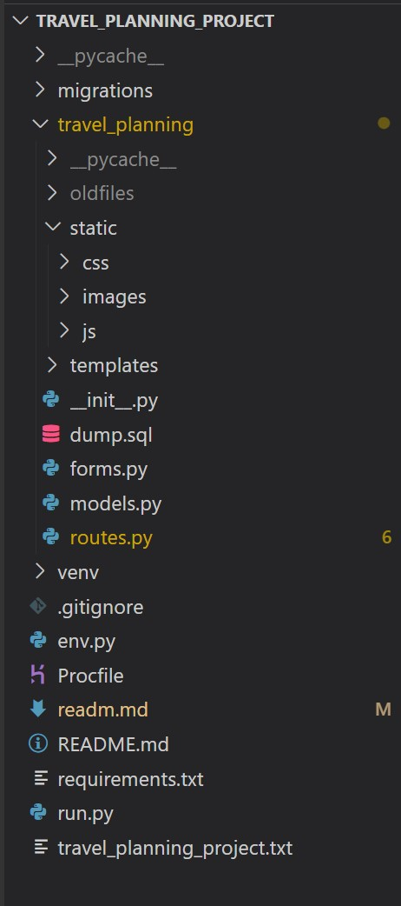
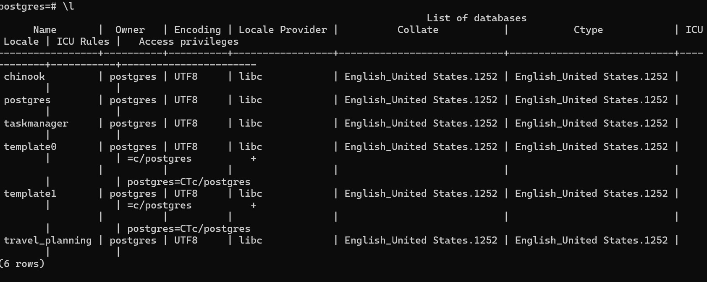
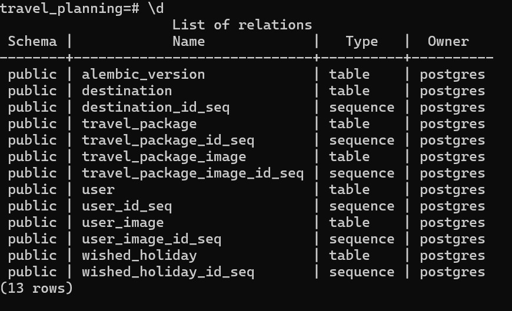

Sure, here's the updated README for your Travel App:

# YourTravelApp


Explore the holiday deals through YourTravelApp, your ultimate travel companion.

Visit the live site: [YourTravelApp.com](https://travelapp.com/)

Embark on a virtual journey, discover new destinations, and plan your next adventure!

## Contents

- [User Experience](#user-experience-ux)
  - [User Stories](#user-stories)
- [Design](#design)
  - [Colour Scheme](#colour-scheme)
  - [Typography](#typography)
  - [Imagery](#imagery)
  - [Wireframes](#wireframes)
  - [Features](#features)
    - [Destination Discovery](#destination-discovery)
    - [Travel Guides](#travel-guides)
    - [User Profiles](#user-profiles)
    - [Interactive Maps](#interactive-maps)
    - [Future Enhancements](#future-enhancements)
  - [Accessibility](#accessibility)
- [Technologies Used](#technologies-used)
  - [Languages Used](#languages-used)
  - [Frameworks, Libraries &amp; Programs Used](#frameworks-libraries--programs-used)
- [Deployment &amp; Local Development](#deployment--local-development)
  - [Deployment](#deployment)
  - [Local Development](#local-development)
    - [How to Fork](#how-to-fork)
    - [How to Clone](#how-to-clone)
- [Testing](#testing)
  - [Automated Testing](#automated-testing)
    - [W3C Validator](#w3c-validator)
    - [JavaScript Validator](#javascript-validator)
    - [Lighthouse](#lighthouse)
  - [Manual Testing](#manual-testing)
    - [Testing User Stories](#testing-user-stories)
    - [Full Testing](#full-testing)
- [Credits](#credits)
  - [Code Used](#code-used)
  - [Content](#content)
  - [Media](#media)
  - [Acknowledgments](#acknowledgments)

---


## User Experience (UX)

### User Stories

#### First Time Visitor Goals

- I want to explore new travel destinations and get inspired for my next trip.
- I want a user-friendly interface that allows me to navigate through the site effortlessly.
- I want to find comprehensive travel guides and information about different holiday packages.

#### Returning Visitor Goals

- I want to interact with an interactive map to plan my itinerary effectively.

#### Frequent Visitor Goals

- I want to contribute by sharing my travel experience and tips.
- I want to connect with other travel enthusiasts .

---

## Design

### Colour Scheme

"The color scheme is thoughtfully curated to capture the essence of adventure and wanderlust. While predominantly earthy tones are employed to evoke a sense of groundedness and connection to nature, the design also incorporates elements of glassmorphism. Background images are strategically utilized to infuse depth and dimension, creating a visually immersive experience that echoes the beauty of the natural world."

- Primary Color: `#643279` (Purple)
- Secondary Colour: `#ffffff` (Shiny White)
- Accent Colour: `#c06c84` (Dusty Rose)
- Background: `#f8b400` (Bright Yellow)


### Typography

The chosen fonts are both modern and easy to read, enhancing the overall user experience.by help from this [Fontpair](https://www.fontpair.co/) website guide.

- Page Title: [Roboto Slab ](https://fonts.google.com/specimen/Roboto?query=roboto)
- Body Text title: [amulya](https://www.fontshare.com/fonts/amulya)
- Body text : [Roboto](https://fonts.google.com/specimen/Roboto?query=roboto)
- Body text : [amulya](https://www.fontshare.com/fonts/amulya)
  

### Imagery

Stunning images of landscapes and iconic landmarks are incorporated to transport users to different corners of the world. Each page features visually appealing photos to enhance the travel experience.

### Wireframes

Wireframes for mobile, desktop were created using microsoft paint.

--Hompage -- hompage desktop and mobile

- - --

--Explored page  -- about share info of their holiday

- 
- 

--About page  -- about compony view


-- Account page -- user own info page

-  - 

-- contact  page -- company contact information

-  - 

--Login page  -- user login page

-  

--Signup page  -- user sign up page

-  

### Features

Explore the rich features of YourTravelApp, meticulously crafted to offer users an immersive and dynamic journey. Leveraging the power of Flask and a robust database system, every corner of the application pulsates with interactivity, ensuring seamless navigation and personalized experiences tailored to each user's preferences.

1. **Responsive Design:**

   - All pages are seamlessly responsive, ensuring a consistent and

 optimal viewing experience across all devices.

2. **Destination Discovery:**

   - Discover new travel destinations through curated cads and showing data in modal with interactive map .
3. **Travel Guides:**

   - Access comprehensive travel guides with useful tips, recommendations, and insights for various populare cities.
4. **User Profiles:**

   - Create a personalized user profile to share travel experiences, connect with other users, in explored page
5. **Interactive Maps:**

   - Plan your itinerary effectively with interactive maps showcasing points of interest, hotels, and attractions.

#### Future Enhancements

- Integration with booking platforms to facilitate hotel and tour reservations.
- User-generated content, including reviews, photos, and travel stories.
- Advanced search filters for tailored destination recommendations.
- Social media integration for seamless sharing and community engagement.

### Accessibility

YourTravelApp is committed to accessibility and strives to provide an inclusive experience for all users. The site is designed with accessibility features such as:

- Semantic HTML for screen readers and assistive technologies.
- High contrast color schemes for improved readability.
- Keyboard navigation support for users with mobility impairments.
- Alt text for images to ensure content comprehension for visually impaired users.

---

-- Deployed pages

### **All pages header and footer was at base html file and specific route generate that page specific route place here for that page .**

---

### **Home page** (route and page images)

### Route Explanation

- **Page**: Home Page
- **Method**: POST, GET
- **Purpose**: Renders the home page and handles the submission of wished holidays.
- **Tech Used**: Flask, Flask SQLAlchemy, Flask-WTF, Bootstrap (for flash messages)
- **Functionality**:

  - Queries all travel packages from the database.
  - Initializes a form for submitting wished holidays (`WishedHolidayForm`).
  - If the form is submitted (`POST` request) and passes validation:
    - Creates a new `WishedHoliday` object with the submitted data.
    - Adds the new `WishedHoliday` object to the database session.
    - Commits the changes to the database.
    - Flashes a success message to the user.
    - Redirects the user to the wished holiday page (`wished_holiday` route).
  - If an exception occurs during database operations:
    - Logs the error message.
    - Flashes an error message to the user.
    - Renders the home page again with the form to handle the exception.
- **Template**: Renders the `home.html` template, passing the following data:

  - `travel_packages`: List of all travel packages queried from the database.
  - `form`: Instance of the `WishedHolidayForm` for submitting wished holidays.
- - 

#### Home Page web

The homepage of Travelapp offers a captivating introduction to the travel experience, blending aesthetics and functionality seamlessly.

- **Site Name and Logo:**

  - The site name and logo take center stage, creating a distinctive visual identity for TravelWander.com.
- **Navbar:**

  - An intuitive navigation bar ensures easy exploration, allowing users to effortlessly access different sections of the website.
- **Social Icons:**

  - Social icons are strategically placed, providing quick links to connect with TravelWander.com on various social media platforms.
- **Welcome Text:**

  - A warm welcome text invites users to embark on a virtual journey, setting the tone for an immersive travel experience.
- **Continents Slides:**

  - Three slides showcasing breathtaking images of different continents create a visually stunning backdrop, offering a glimpse into the diverse destinations awaiting exploration.
- **Company Information:**

  - Information about the company is elegantly presented, providing insights into TravelWander's mission and offerings.
- **Customer Reviews:**

  - Customer reviews add a personal touch, offering authentic perspectives and enhancing the credibility of the travel services.
- **Background :**

  - A dynamic background  runs throughout the homepage, adding a touch of dynamism and reinforcing the travel theme.
- **Modal for Deals:**

### Homepage Travel Deals Modal

The homepage of travelapp introduces users to enticing travel deals displayed as interactive cards. Upon clicking on a travel deal card, users can access a detailed modal window that provides comprehensive information about the selected deal. This modal enhances the user experience by offering a convenient way to explore key details and make informed decisions regarding their travel plans.

- 
- **Modal Content:**

  - The modal window presents essential details such as the price of the travel package, destination, duration of the holiday, and any special offers or discounts available. By displaying this information prominently, users can quickly assess the value and suitability of the travel deal, facilitating efficient decision-making.
- **Interactive Map:**

  - In addition to textual information, the modal incorporates an interactive map feature that visualizes the destination of the travel package. By leveraging mapping technologies, users can gain insights into the geographical location, nearby attractions, and points of interest associated with the holiday destination, enhancing their understanding and appreciation of the travel offer.
- **Contact Information:**

  - To further assist users and address any inquiries or concerns, the modal includes contact details such as telephone numbers or email addresses for reaching out to travelapp's customer support team. This direct communication channel enables users to seek personalized assistance, receive expert guidance, and make informed decisions regarding their travel arrangements.

By integrating a feature-rich modal window into the homepage's travel deal cards, travelapp enhances user engagement and satisfaction, providing a seamless browsing experience that empowers users to explore, evaluate, and book their dream holidays with confidence and ease.

---

### Explore Route Explanation

* **Page** : Explore Page
* **Method** : POST, GET
* **Purpose** : Renders the explore page and handles the addition of new destinations.
* **Tech Used** : Flask, Flask SQLAlchemy, Flask-WTF, Bootstrap (for flash messages)
* **Functionality** :
* Initializes a form for adding destinations (`AddDestinationForm`).
* Checks if the user is authenticated:
  * If authenticated:
    * Handles form submission:
      * Saves the uploaded image and retrieves the file path.
      * Creates a new `Destination` object with the submitted data.
      * Adds the new `Destination` object to the database session.
      * Commits the changes to the database.
      * Flashes a success message to the user.
      * Redirects the user back to the explore page.
    * Retrieves all destinations ordered by name from the database.
  * If not authenticated:
    * Retrieves all destinations from the database.
* Renders the `explore.html` template, passing the following data:
  * `form`: Instance of the `AddDestinationForm` for adding destinations.
  * `all_destinations`: List of all destinations queried from the database.

This route handles the rendering of the explore page and allows authenticated users to add new destinations. It utilizes forms for data submission and interacts with the database to store and retrieve destination information.

- 

## Explore Page web

The "Explore" page of travelapp serves as a dynamic platform for users to share their latest holiday experiences, complete with captivating images and personal anecdotes. Utilizing Bootstrap's card feature, each submission is elegantly presented in a visually appealing format, enhancing readability and engagement.

- **User Submissions:**

  - Users can effortlessly post their recent holiday details, including destination highlights, activities, and memorable moments. Accompanied by stunning images, each submission offers a unique glimpse into diverse travel experiences, inspiring others to embark on their adventures.
- **Interactive Cards:**

  - Bootstrap cards facilitate seamless navigation and interaction, allowing users to explore submissions with ease. The inclusion of edit and delete buttons empowers users to modify their content, ensuring flexibility and control over their posted experiences.
- **Database Interaction:**

  - Behind the scenes, travelapp seamlessly interacts with the database to retrieve, display, and manage user submissions. Leveraging the power of Flask and SQLAlchemy, the platform delivers a seamless user experience, enabling smooth data handling and efficient content management.

Through a combination of intuitive design, interactive features, and robust database functionality, the "Explore" page invites users to share their travel tales, connect with fellow adventurers, and discover new destinations in an immersive and engaging manner.

---

### about Route Explanation

- **Page**: About Us Page
- **Method**: POST, GET
- **Purpose**: Renders the about us page.
- **Tech Used**: Flask, Flask SQLAlchemy, Jinja (for templating)
- **Functionality**:
  - Renders the `about_us.html` template, which displays information about the website or organization.
- **Template**: Renders the `about_us.html` template, which typically includes information such as the purpose of the website, team members, mission statement, and contact information.

This route simply renders the about us page without any additional functionality. It serves as a static page to provide information about the website or organization to the users.

- 

#### About Page

The "About" page of travelapp offers a glimpse into our vision, approach, and the process behind our platform's creation. Designed to be both informative and engaging, this page provides insights into what drives us and how we strive to deliver exceptional travel experiences.

- **Our Vision:**

A compelling image accompanies our vision statement, symbolizing our commitment to revolutionizing the way people explore the world. Through innovative technology and unparalleled service, we aspire to inspire wanderlust and facilitate memorable journeys for every traveler.

- **Our Approach:**

An illustrative image complements our approach, highlighting our dedication to personalization, convenience, and sustainability. We believe in tailoring travel experiences to individual preferences, simplifying the booking process, and promoting eco-conscious practices to protect our planet for future generations.

- **Our Process:**

Step-by-step visuals outline our process, from conceptualization to implementation, showcasing our meticulous attention to detail and user-centric design philosophy. By prioritizing user feedback, continuous improvement, and seamless integration of cutting-edge technologies, we ensure that every aspect of travelapp reflects our commitment to excellence.

---

- 

## Account Page

The "Account" page of travelapp offers users a personalized space to view and manage their profile information, including uploaded images and details of their last wished holiday. With a focus on user-centric design and functionality, this page provides a seamless experience for users to interact with their account settings and preferences.

- **Profile Information:**

  - Users can access and update their profile information, including username, email, and any additional details provided during registration. The user-friendly interface ensures easy navigation and efficient management of account details.
- **Upload Personal Image:**

  - A dedicated feature enables users to upload a personalized profile image, enhancing their presence and adding a touch of personalization to their account. Utilizing Flask's file upload functionality, users can effortlessly select and upload images directly from their device.
- **Last Wished Holiday:**

  - As part of the user experience enhancement, travelapp displays details of the user's last wished holiday on the "Account" page. Leveraging data stored in the WishedHoliday table, users can conveniently reference their desired holiday preferences, facilitating future travel planning and exploration.
- **Database Integration:**

  - Behind the scenes, travelapp seamlessly integrates with a database system to retrieve and display user information, uploaded images, and wished holiday details. Leveraging Flask-SQLAlchemy, the platform ensures secure data storage and efficient data retrieval, enhancing the overall user experience.

Through a combination of intuitive design, personalized features, and robust database functionality, the "Account" page empowers users to manage their profile, upload personalized content, and access essential information, fostering a seamless and engaging user experience.
---------------------------------------------------------------------------------------------------------------------------------------------------------------------------------------------------------------------------------------------------------------------------------

- 

## Contact Page

The "Contact" page of travelapp serves as a centralized hub for users to access essential contact information and connect with the platform's administrators. With a focus on accessibility and user engagement, this page provides convenient access to support channels and location details.

- **Contact Information:**

  - Users can easily locate contact details, including email addresses and phone numbers, enabling seamless communication with travelapp's support team. The intuitive layout ensures quick access to essential information, facilitating efficient resolution of inquiries and support requests.
- **Interactive Map:**

  - An interactive map feature enhances the user experience by visually representing the geographical location of travelapp's headquarters or primary operating regions. Leveraging mapping APIs, users can explore the platform's physical presence and gain insights into its global reach and coverage.
- **Email Integration:**

  - To streamline communication and facilitate direct inquiries, travelapp offers users the option to send emails directly from the "Contact" page. By integrating email functionality, users can compose messages within the platform, minimizing friction and enhancing convenience.
- **User-friendly Interface:**

  - The "Contact" page features a user-friendly interface designed to promote ease of use and accessibility. Clear navigation elements and prominently displayed contact information ensure that users can quickly locate and utilize the available communication channels without any hassle.

Through its comprehensive approach to user support and engagement, the "Contact" page reinforces travelapp's commitment to customer satisfaction and service excellence. By providing users with accessible contact information, interactive map functionality, and seamless email integration, the platform empowers users to connect with ease and confidence, fostering a positive and enriching user experience.

---

- 

- 

## Signup and Login Pages

The "Signup" and "Login" pages of travelapp serve as key entry points for users to access and interact with the platform's features securely. Designed with a focus on user authentication and account management, these pages provide a seamless and intuitive experience for new users registering for membership and existing members logging into their accounts.

- **Signup Page:**

  - The "Signup" page enables new users to create an account and become members of the travelapp community. With a user-friendly registration form, users can provide essential information, such as username, email address, and password, to establish their accounts securely. Stringent validation checks ensure data accuracy and integrity, enhancing the overall signup process and mitigating potential errors or discrepancies.
- **Login Page:**

  - The "Login" page offers registered users convenient access to their accounts, facilitating secure authentication and personalized interactions with travelapp's features. Utilizing industry-standard encryption protocols, such as HTTPS and secure password hashing, the login process ensures robust protection of user credentials and sensitive information. Through a streamlined login interface, users can enter their credentials confidently, knowing that their privacy and security are prioritized.
- **Database Integration:**

  - Both the "Signup" and "Login" pages seamlessly interact with travelapp's secure database infrastructure, storing and retrieving user account data in a protected environment. By leveraging database technologies and secure authentication mechanisms, the platform maintains data integrity and confidentiality, safeguarding user information against unauthorized access or manipulation.
- **Responsive Design:**

  - The "Signup" and "Login" pages feature responsive design elements, ensuring optimal display and functionality across various devices and screen sizes. Whether accessing the platform from a desktop computer, tablet, or smartphone, users can enjoy a consistent and accessible signup and login experience, enhancing usability and convenience.

Through its commitment to user privacy, security, and usability, travelapp's "Signup" and "Login" pages establish a strong foundation for user engagement and satisfaction. By prioritizing data protection, seamless integration, and responsive design, the platform empowers users to register, login, and access its features with confidence and ease.

## Backend of application

#### 1. Introduction

Welcome to the backend of our Flask TravelApp project! In this section, we'll delve into the inner workings of our backend architecture, exploring its crucial role in managing server-side operations, processing data, and interacting with the database.

The backend serves as the backbone of our application, handling various tasks such as user authentication, data retrieval and manipulation, and business logic implementation. It plays a pivotal role in ensuring the smooth functioning of the application, providing the necessary infrastructure for delivering content to users and facilitating seamless interactions between the frontend and the database.

A well-designed backend is essential for maintaining the integrity and reliability of our application. It enables us to efficiently process user requests, handle complex business logic, and manage data persistence, ultimately contributing to a positive user experience.

In the following sections, we'll explore the technologies, database structure, and route explanations that comprise our backend architecture, offering insights into the underlying mechanisms that power our Flask TravelApp.but first lests see  file structure



### **File Structure:**

**-Core application structure:**

* **run.py:** The main Flask application file that launches the server and routes requests to appropriate handlers.
* **routes.py:** Defines URL routing logic and logic for handling incoming requests. It renders templates, interacts with data models, and serves as the central entry point for application functionality.
* **models.py:** Defines data models that represent entities in your application. These models typically interact with a database using an ORM like SQLAlchemy.
* **forms.py:** Defines forms for user input validation. Forms help ensure data integrity and provide a structured way to collect user input. WTForms is a common library used for form creation.
* **templates/**: Contains HTML templates that define the application's user interface. Flask renders these templates with dynamic content populated from data models and forms.

**-Application configuration:**

* **__init__.py:** An empty file or file containing initialization code for the package. In some cases, it might import core modules to establish the package structure.
* **env.py:** Defines sensitive configuration settings like security keys, database URLs, and mail service details. This file should **never** be committed to version control (e.g., GitHub) due to the sensitive nature of its contents.
* **.gitignore:** A file that specifies files and directories to be excluded from version control. This helps prevent sensitive information (like `env.py`) and unnecessary files (like `venv`) from being committed to repository.

**-Deployment:**

* **Procfile:** (Optional) A file used by deployment platforms like Heroku to specify the commands to run your application in a production environment.
* **Requirements.txt:** A file that lists the Python packages required by your application. This file ensures that the same dependencies are installed on different environments, promoting consistency and reproducibility.

**Additional :**

* **static/**: This directory is included in your response, but it's a common location to store static assets like CSS, JavaScript, and image files that are directly accessible to the web browser.
* **dump.sql**: This SQL dump file is used to replicate your database on Heroku Postgres.
* **Maintain consistent formatting:** Use consistent indentation and spacing to improve readability.

### 2. Technologies and Frameworks:

"**To ensure the proper functioning of this application, the following technologies must be imported within the routes.py file.**"

Here's an updated list of technologies and frameworks used in your Flask TravelApp project :

* Flask: A lightweight and flexible web framework for Python.
* Flask SQLAlchemy: A Flask extension that adds ORM support for SQLAlchemy, facilitating database interactions.
* Flask Login: A Flask extension for managing user authentication and session management.
* Flask Mail: A Flask extension for sending email messages.
* PostgreSQL: A powerful open-source relational database management system used for data storage in the application.
* Werkzeug: A utility library for WSGI (Web Server Gateway Interface) applications, used in Flask for file handling and other tasks.
* Jinja2: A templating engine for Python, used in Flask for generating dynamic HTML content.
* Psycopg2: A PostgreSQL adapter for Python, used for interacting with the PostgreSQL database.
* SQLAlchemy: A SQL toolkit and Object-Relational Mapping (ORM) library for Python, used in conjunction with Flask SQLAlchemy for database operations.
* SMTPlib: A Python library for sending email messages via the Simple Mail Transfer Protocol (SMTP).
* Heroku: A cloud platform that hosts your Flask application and provides tools for deployment, scaling, and monitoring.

### Database Structure:

This application utilizes a PostgreSQL database for storing data. The database schema was designed to efficiently manage application data such as users, destinations, and travel plans.

To define the database structure, models were created using a Python framework (e.g., SQLAlchemy). These models represent the data entities captured by the application forms, ensuring consistent data storage and retrieval.

***Travel_planning DB***

The provided images (db_pic1.jpg and db_pic2.jpg) illustrate the relationships between the database tables.





To ensure the proper creation of database tables, I meticulously examined the forms utilized on each page of the application. Understanding the data input requirements of these forms was crucial for designing the database schema effectively.

To translate these form structures into database tables, I created two essential files: models.py and forms.py. The models.py file defined the database models corresponding to each form, specifying the fields and their data types. On the other hand, the forms.py file encapsulated the form structures themselves, facilitating data validation and user input handling.

This systematic approach ensured that the database tables accurately represented the data captured by the application forms, establishing a robust foundation for seamless data management and retrieval.

###### For the homepage,

    -route (/)

Here's the table specifically for the home route,

| Route (URL Pattern) | HTTP Method | Description                              | Page Interaction                                      | Database Table(s) | Related models.py Classes | Related forms.py Classes |
| ------------------- | ----------- | ---------------------------------------- | ----------------------------------------------------- | ----------------- | ------------------------- | ------------------------ |
| `/` (Home)        | GET         | Displays the homepage                    | - Show "Travel Packages" section                      | `TravelPackage` | `TravelPackage`         | -                        |
| `/` (Home)        | POST        | Handles "Wished Holiday" form submission | - Process and store user's wished holiday preferences | `WishedHoliday` | `WishedHoliday`         | `WishedHolidayForm`    |

I've implemented a feature to display enticing deals to users. These deals are sourced from a dedicated table in the database called TravelPackage.

```
def home():
  
    travel_packages 			=    TravelPackage.query.all()
```

To achieve this, I created a database model named TravelPackage to represent each deal. This model is closely integrated with a form specifically designed for adding new deals, which is accessible through an admin-only page called ***add_travel_package.***

The add_travel_package page, although not visible to regular users, serves as a management interface for administrators to insert new deals into the TravelPackage table.

* modal part deals use these data as well

-route('/add_travel_package', methods=['GET', 'POST'])

| Route (URL Pattern)     | HTTP Method | Description                                  | Page Interaction                               | Database Table(s)                         | Related models.py Classes                 | Related forms.py Classes |
| ----------------------- | ----------- | -------------------------------------------- | ---------------------------------------------- | ----------------------------------------- | ----------------------------------------- | ------------------------ |
| `/add_travel_package` | GET         | Displays the "Add Travel Package" form       | - Renders the form to add a new travel package | None                                      | None                                      | `AddTravelPackageForm` |
| `/add_travel_package` | POST        | Handles "Add Travel Package" form submission | - Processes and stores new travel package data | `TravelPackage`, `TravelPackageImage` | `TravelPackage`, `TravelPackageImage` | `AddTravelPackageForm` |

**Explanation:**

* The table shows both GET and POST methods for the home route (`/`).
* The GET request:
  * Retrieves all `TravelPackage` objects from the database using `TravelPackage.query.all()`.
  * Renders the "home.html" template, passing the retrieved travel packages and an empty `WishedHolidayForm` to the template context.
* The POST request:
  * Validates the submitted `WishedHolidayForm` data.
  * Creates a new `WishedHoliday` object with data from the form, including user ID retrieved from `current_user` (ensure it's correct).
  * Adds the `WishedHoliday` object to the database session using `db.session.add(wished_holiday)`.
  * Commits the changes to the database using `db.session.commit()`.
  * Handles potential exceptions (e.g., database errors) using a `try-except` block:
    * On success, flashes a success message and redirects to the `wished_holiday` route (assuming it exists).
    * On error, logs the error, flashes an error message, and re-renders the `home.html` template with the form.

###### for Explore page

users be able to see where other user went for holiday and see a picture of and while any use who post this data could edit or delete this info ,and these two buttons was disable for other user . and routes used for this page , was

```
@app.route('/explore', methods=['GET', 'POST'])

def explore():

@app.route('/explore/delete/[int:destination_id](int:destination_id)', methods=['POST'])

def delete_destination(destination_id):

@app.route('/explore/edit/[int:destination_id](int:destination_id)', methods=['GET', 'POST'])

def edit_destination(destination_id):
```

| Route (URL Pattern)                      | HTTP Method           | Description                                         | Page Interaction                                                          | Database Table(s) | Related models.py Classes | Related forms.py Classes                               |
| ---------------------------------------- | --------------------- | --------------------------------------------------- | ------------------------------------------------------------------------- | ----------------- | ------------------------- | ------------------------------------------------------ |
| `/explore` (GET)                       | GET                   | Displays the "Explore" page                         | - Shows all destinations                                                  | `Destination`   | `Destination`           | `AddDestinationForm` (optional, for logged-in users) |
| `/explore` (GET)                       | GET (logged-in user)  | Displays the "Explore" page with additional actions | - Shows all destinations                                                  | `Destination`   | `Destination`           | `AddDestinationForm`                                 |
| `/explore` (POST)                      | POST (logged-in user) | Handles "Add Destination" form submission           | - Adds a new destination for the logged-in user, including image upload   | `Destination`   | `Destination`           | `AddDestinationForm`                                 |
|                                          |                       |                                                     | - Saves the uploaded image and associates it with the new destination     |                   |                           |                                                        |
| `/explore/delete/<int:destination_id>` | POST                  | Handles "Delete Destination" action                 | - Deletes a specific destination (if user is authorized)                  | `Destination`   | `Destination`           | None                                                   |
| `/explore/edit/<int:destination_id>`   | GET                   | Displays the "Edit Destination" form                | - Renders the form to edit a specific destination (if user is authorized) | `Destination`   | `Destination`           | `EditDestinationForm`                                |
| `/explore/edit/<int:destination_id>`   | POST                  | Handles "Edit Destination" form submission          | - Updates the edited destination (if user is authorized)                  | `Destination`   | `Destination`           | `EditDestinationForm`                                |

**Explanation:**

* The table shows the different scenarios based on user authentication and HTTP methods.
* Logged-in users have additional functionalities like adding destinations.
* The GET request for non-logged-in users:
  * Displays the "Explore" page with all destinations (`all_destinations = Destination.query.all()`).
  * Optionally includes the `AddDestinationForm` (depending on your implementation).
* The GET request for logged-in users:
  * Displays the "Explore" page with all destinations (`all_destinations = Destination.query.order_by(Destination.name).all()`).
  * Includes the `AddDestinationForm` for adding new destinations.
* The POST request for logged-in users:
  * Validates the submitted `AddDestinationForm` data.
  * Saves the uploaded image using `save_destination_image(form.image.data)` and stores the path in `image_path`.
  * Creates a new `Destination` object with form data and the saved image path.
  * Adds the new destination to the database and commits the changes.
  * Flashes a success message, redirects to the `explore` page.

---

###### for sign up page

user by entering required data in form  would be able join this web and route related to deal with entered data was :

```
@app.route('/signup', methods=['GET', 'POST'])
def signup():
```

    Table for`/signup` Route

| Route (URL Pattern) | HTTP Method | Description                    | Page Interaction                                                                          | Database Table(s) | Related models.py Classes | Related forms.py Classes |
| ------------------- | ----------- | ------------------------------ | ----------------------------------------------------------------------------------------- | ----------------- | ------------------------- | ------------------------ |
| `/signup`(GET)    | GET         | Displays the signup form       | - Renders the form for user registration                                                  | `User`          | `User`                  | `SignupForm`           |
| `/signup`(POST)   | POST        | Handles signup form submission | - Processes and stores user registration data                                             | `User`          | `User`                  | `SignupForm`           |
|                     |             |                                | -**Stores passwords securely using hashing (implemented in `User.set_password`)** |                   |                           |                          |

**Explanation:**

* The table shows both GET and POST methods for the signup route.
* The GET request:
  * Renders the `signup.html` template with an empty `SignupForm` for users to enter their information.
* The POST request:
  * Validates the submitted form data using `form.validate_on_submit()`.
  * Extracts username, email, and password from the form.
  * Checks for existing usernames or emails in the `User` table using a query:
    * `existing_user = User.query.filter((User.username == username) | (User.email == email)).first()`.
  * If an existing user is found, flashes an error message.
  * If no existing user is found:
    * Creates a new `User` object with the provided information.
    * Sets the user's password securely using `new_user.set_password(password)`.
    * Adds the new user to the database session using `db.session.add(new_user)`.
    * Commits the changes to the database using `db.session.commit()`.
    * Flashes a success message and logs in the new user using `login_user(new_user)`.
    * Redirects the user to the home page (`url_for('home')`).

---

###### for Login  page

user by entering required data in form  would be able to enter to his accoutn and routes related to deal with entered data was :

```
@login_manager.user_loader
def load_user(user_id):
    return User.query.get(int(user_id))

@app.route('/login', methods=['GET', 'POST'])
def login():
  
```

Table for Routes:

| Route (URL Pattern)                      | HTTP Method     | Description                   | Page Interaction                                           | Database Table(s)   | Related models.py Classes | Related forms.py Classes        |
| ---------------------------------------- | --------------- | ----------------------------- | ---------------------------------------------------------- | ------------------- | ------------------------- | ------------------------------- |
| **`@login_manager.user_loader`** | N/A (Decorator) | Defines user loader function  | - N/A                                                      | `User`            | `User`                  | N/A                             |
| `/login`(GET)                          | GET             | Displays the login form       | - Renders the form for entering username and password      | `User`(potential) | `User`                  | N/A (potentially `LoginForm`) |
| `/login`(POST)                         | POST            | Handles login form submission | - Processes login credentials, validates against user data | `User`            | `User`                  | N/A (potentially `LoginForm`) |

juse explain login_manager :

**`@login_manager.user_loader`:**

This decorator defines a function named `load_user` that acts as the user loader for Flask-Login. Its purpose is to retrieve a user object based on the provided user ID.

**Explanation:**

* The `@login_manager.user_loader` decorator associates the `load_user` function with the Flask-Login instance.
* The function takes a `user_id` argument representing the unique identifier of the user.
* It uses the `User.query.get(int(user_id))` expression to retrieve the user object from the database based on the provided ID (converted to an integer).
* This function is crucial for Flask-Login to manage user sessions and identify logged-in users.

> These routes demonstrate essential user authentication functionalities. The `load_user` function establishes a mechanism for Flask-Login to retrieve users, while the `/login` route handles login requests, validates credentials, and manages user sessions

---

###### for login  page forget password link

```
@app.route('/reset_password_request', methods=['GET', 'POST'])
def reset_password_request():
```

**Table for `/reset_password_request` Route:**

| Route (URL Pattern)               | HTTP Method | Description                                      | Page Interaction                                             | Database Table(s)   | Related models.py Classes | Related forms.py Classes     |
| --------------------------------- | ----------- | ------------------------------------------------ | ------------------------------------------------------------ | ------------------- | ------------------------- | ---------------------------- |
| `/reset_password_request`(GET)  | GET         | Displays the "Reset Password Request" form       | - Renders the form for entering email address                | `User`(potential) | `User`                  | `ResetPasswordRequestForm` |
| `/reset_password_request`(POST) | POST        | Handles "Reset Password Request" form submission | - Processes email address, sends password reset instructions | `User`            | `User`                  | `ResetPasswordRequestForm` |

**Explanation:**

* The table shows both GET and POST methods for the route.
* The GET request renders the "Reset Password Request" form for users to enter their email address.
* The POST request:
  * Validates the form data.
  * Checks if the email exists in the `User` table (using `User.query.filter_by(email=form.email.data).first()`)
  * If the email exists:
    * Generates a secure token for password resetting.
    * Saves the token in the user's `reset_password_token` attribute.
    * Creates an email message with HTML content (including a reset link) and sends it to the user's email address using Flask-Mail.
    * Flashes a success message if the email is sent successfully.
  * If the email doesn't exist, flashes an error message.
* The route redirects back to the login page (`url_for('login')`) in all cases.

**Additional Note:**

* Remember to configure Flask-Mail with your email server settings.
  ---

###### for reset_password page

```
@app.route('/reset_password_token/<token>', methods=['GET', 'POST'])
def reset_password_token(token):
```

Table for `/reset_password_token/<token>` Route:

| Route (URL Pattern)                     | HTTP Method | Description                              | Page Interaction                               | Database Table(s)   | Related models.py Classes | Related forms.py Classes |
| --------------------------------------- | ----------- | ---------------------------------------- | ---------------------------------------------- | ------------------- | ------------------------- | ------------------------ |
| `/reset_password_token/<token>`(GET)  | GET         | Displays the "Reset Password" form       | - Renders the form for entering a new password | `User`(potential) | `User`                  | `ResetPasswordForm`    |
| `/reset_password_token/<token>`(POST) | POST        | Handles "Reset Password" form submission | - Processes and updates the user's password    | `User`(potential) | `User`                  | `ResetPasswordForm`    |

**Explanation:**

* The table shows both GET and POST methods for the route.
* The `<token>` in the URL pattern represents a unique token associated with the password reset request.
* The GET request:
  * Retrieves the user object (potentially using the token) - Note: The example code uses `User.query.get(1)` which is not recommended for production due to bypassing token validation.
  * Renders the "Reset Password" form for entering the new password.
* The POST request:
  * Validates the form data.
  * Updates the user's password using `user.set_password(form.password.data)`, ensuring secure hashing (replace `bcrypt` with your chosen method).
  * Saves the changes to the database using `db.session.commit()`.
  * Flashes a success message and redirects to the login page.

**Important Notes:**

* The provided code snippet uses `User.query.get(1)` to retrieve the user, which is not secure and bypasses token validation. In a production environment, you should use the token to retrieve the associated user object and ensure it's valid before allowing password reset.

> This table and explanation provide a general overview of the route's functionality. Remember to adjust the details and implement proper security measures based on your specific implementation and user authentication requirements.

---

###### for account page

to show wished holiday form which was filled in homepage

```
@app.route('/account', methods=['GET', 'POST'])
@login_required
def account():
  

    # Retrieve wished holidays associated with the current user
    wishes = WishedHoliday.query.filter_by(user_id=current_user.id).all()
```

| Route (URL Pattern) | HTTP Method | Description                                                   | Page Interaction                                                    | Database Table(s)        | Related models.py Classes | Related forms.py Classes |
| ------------------- | ----------- | ------------------------------------------------------------- | ------------------------------------------------------------------- | ------------------------ | ------------------------- | ------------------------ |
| /account            | GET, POST   | Renders the user account page and handles user image uploads. | Displays user account details and allows uploading a profile image. | WishedHoliday, UserImage | WishedHoliday, UserImage  | UserImageForm            |

Explanation:

- The table outlines the functionality of the /account route, which allows users to view and manage their account details.
- Both GET and POST methods are used for this route.
- The GET request:
  - Retrieves wished holidays associated with the current user from the WishedHoliday table using a query.
  - Retrieves the user's profile image path from the UserImage table if it exists.
  - Creates an instance of the UserImageForm for uploading a new profile image.
  - Renders the account.html template, passing the current user object, profile image path, user image form, and wished holidays data to the template.
- The POST request:
  - Validates the submitted form data using user_image_form.validate_on_submit().
  - Saves the uploaded image file to the static/images folder.
  - Updates the user's profile image path in the UserImage table or creates a new record if it doesn't exist.
  - Commits the changes to the database.
  - Flashes a success message and redirects the user back to the account page.
- The table provides clarity on the interaction between the backend logic, database operations, and user interface for the /account route.

---

### 6. Code Snippets:

- Include relevant code snippets from your Flask routes, models, and forms to illustrate how the backend functionality is implemented.
- Use fenced code blocks with appropriate syntax highlighting to make the code readable.

### 7. Deployment:

- If your Flask TravelApp project is deployed, provide instructions or a brief overview of the deployment process.
- Include any configuration steps required for deployment, such as setting environment variables or configuring the database.

### 8. Conclusion:

- Summarize the key features of the backend and how they contribute to the overall functionality of the Flask TravelApp project.
- Emphasize the importance of the backend in delivering a seamless user experience and achieving the project goals.

For your Flask TravelApp project, you can start by introducing the backend, highlighting the technologies and frameworks used, describing the database structure, and explaining the API endpoints and routes. As you proceed, you can provide code snippets and deployment instructions to give users a comprehensive understanding of the backend implementation.

## Technologies Used

### Languages Used

- HTML5
- CSS3
- PYTHON
- FLASK
- JavaScript

### Frameworks, Libraries & Programs Used

- [Python Flask](https://flask.palletsprojects.com/): Micro web framework for building web applications in Python.
- [PostgreSQL](https://www.postgresql.org/): Open-source relational database management system for storing application data.
- [Bootstrap](https://getbootstrap.com/): Front-end framework for responsive design.
- [jQuery](https://jquery.com/): JavaScript library for DOM manipulation and event handling.
- [Font Awesome](https://fontawesome.com/): Icon library for scalable vector icons.
- [Google Fonts](https://fonts.google.com/): Source of custom fonts for enhanced typography.
- [Adobe XD](https://www.adobe.com/products/xd.html): Design tool for wireframing and prototyping.
- [GitHub](https://github.com/): Version control and collaboration platform.
- [Git](https://git-scm.com/): Distributed version control system.
- [Visual Studio Code](https://code.visualstudio.com/): Code editor for writing and editing code.

---

## Deployment & Local Development

### Deployment

YourTravelApp is deployed using GitHub Pages. To deploy the site:

1. Navigate to the repository settings on GitHub.
2. Scroll down to the GitHub Pages section.
3. Select the main branch as the source.
4. The site will be automatically deployed, and the link will be provided.

### Local Development

To run YourTravelApp locally, follow these steps:

#### How to Fork

1. Log in to GitHub and locate the repository: [YourTravelApp](https://github.com/yourusername/yourtravelapp).
2. At the top right of the page, click the Fork button.
3. After forking, you'll have a copy of the repository in your GitHub account.

#### How to Clone

1. Clone the repository to your local machine using the following command:

   ```
   git clone https://github.com/yourusername/yourtravelapp.git
   ```
2. Navigate to the project directory:

   ```
   cd yourtravelapp
   ```
3. Open the index.html file in your browser to view the site locally.

---

## Testing

### Automated Testing

Automated testing was conducted using various tools to ensure the quality and performance of YourTravelApp.

#### W3C Validator

All HTML files were tested using the W3C Markup Validation Service to identify any syntax errors or warnings.

#### JavaScript Validator

JavaScript code was validated using JSHint to detect any potential errors or issues.

#### Lighthouse

Lighthouse audits were performed to assess the site's performance, accessibility, best practices, and SEO.

### Manual Testing

Manual testing was conducted to validate user stories and ensure the functionality of all features.

#### Testing User Stories

- **First Time Visitor Goals:**

  - Navigated through the site to explore different destinations.
  - Found the interface intuitive and easy to use.
  - Accessed travel guides and information about holiday packages.
- **Returning Visitor Goals:**

  - Interacted with the interactive map to plan an itinerary.
- **Frequent Visitor Goals:**

  - Created a user profile and shared travel experiences.
  - Connected with other users through the community forum.

#### Full Testing

Comprehensive testing was performed on all pages, forms, buttons, and interactive elements to ensure proper functionality and responsiveness across devices.

---

## Credits

### Code Used

- Bootstrap: [https://getbootstrap.com/](https://getbootstrap.com/)
- jQuery: [https://jquery.com/](https://jquery.com/)
- Font Awesome: [https://fontawesome.com/](https://fontawesome.com/)
- Google Fonts: [https://fonts.google.com/](https://fonts.google.com/)

### Content

- Travel guides and destination information sourced from reputable travel websites and tourism boards.

### Media

- Images sourced from Unsplash, Pixabay, and Pexels.
- Icons sourced from Font Awesome.

### Acknowledgments

Special thanks to the following individuals and resources:

- Stack Overflow community for troubleshooting assistance.
- Code Institute tutors for guidance and support.
- Friends and family for feedback and encouragement.

---

[Back to Top](#yourtravelapp)
